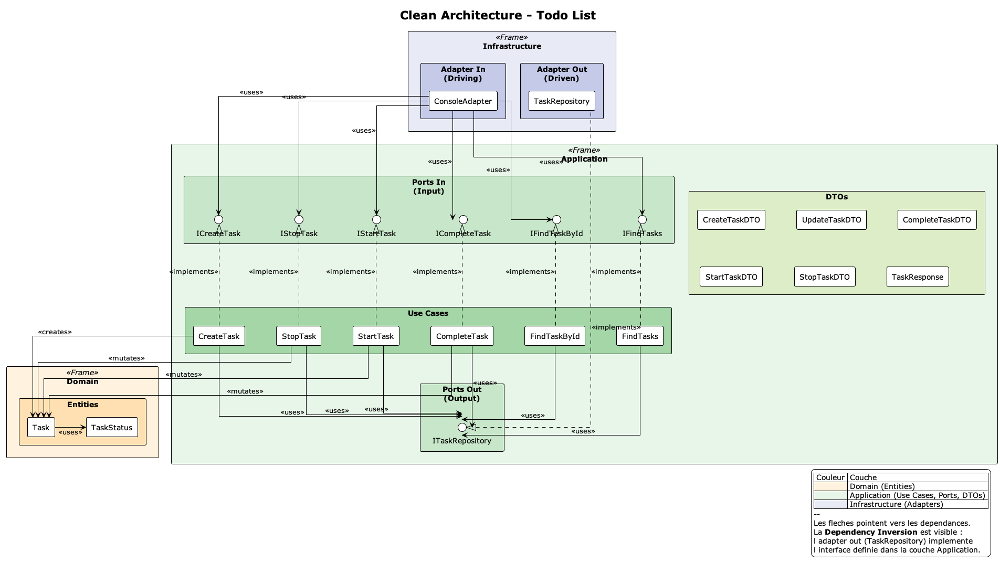

# Yet another To-do list

Projet modèle pour l'implémentation de la __Clean Architecture__ en TypeScript.

- Créer, afficher, marquer comme terminée et supprimer des tâches.
- Une tâche (Task) est caractérisée par un id, un contenu, un statut (TODO | DOING | DONE) par défaut égal à TODO.
Règles métier :
- Le contenu est obligatoire et non vide.
- Impossible de supprimer une tâche déjà marquée DONE.

  ┌────────────────┬────────────────────────┬──────────────────────────────────────────────────────────────────────────────────────┐
  │     Couche     │        Fichier         │                                        Tests                                         │
  ├────────────────┼────────────────────────┼──────────────────────────────────────────────────────────────────────────────────────┤
  │ Domain         │ Task.test.ts           │ Constructor (default status, UUID, empty throw), markAsCompleted, start, stop, toDTO │
  ├────────────────┼────────────────────────┼──────────────────────────────────────────────────────────────────────────────────────┤
  │ Application    │ CreateTask.test.ts     │ Appelle create, retourne TaskResponse                                                │
  ├────────────────┼────────────────────────┼──────────────────────────────────────────────────────────────────────────────────────┤
  │                │ FindTasks.test.ts      │ Retourne tableau de DTOs, tableau vide                                               │
  ├────────────────┼────────────────────────┼──────────────────────────────────────────────────────────────────────────────────────┤
  │                │ FindTaskById.test.ts   │ Retourne DTO si trouvé, null sinon                                                   │
  ├────────────────┼────────────────────────┼──────────────────────────────────────────────────────────────────────────────────────┤
  │                │ CompleteTask.test.ts   │ Mute vers DONE + persiste, throw si non trouvé                                       │
  ├────────────────┼────────────────────────┼──────────────────────────────────────────────────────────────────────────────────────┤
  │                │ StartTask.test.ts      │ Mute vers DOING + persiste, throw si non trouvé                                      │
  ├────────────────┼────────────────────────┼──────────────────────────────────────────────────────────────────────────────────────┤
  │                │ StopTask.test.ts       │ Mute vers TODO + persiste, throw si non trouvé                                       │
  ├────────────────┼────────────────────────┼──────────────────────────────────────────────────────────────────────────────────────┤
  │ Infrastructure │ TaskRepository.test.ts │ create, findAll, findOneById, update, remove                                         │
  └────────────────┴────────────────────────┴──────────────────────────────────────────────────────────────────────────────────────┘

  

--

__Alexandre Leroux__  
_Enseignant / Formateur_  
_Développeur logiciel web & mobile_

Nancy (Grand Est, France)

<https://shrp.dev>
